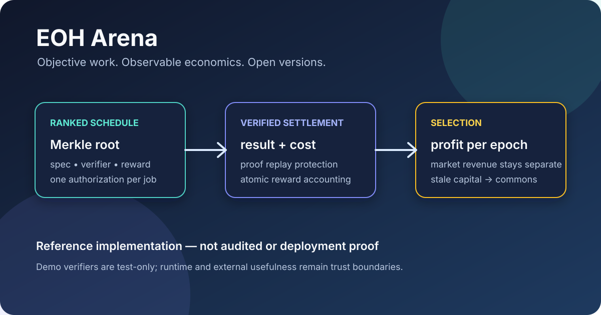

# EOH Arena (v0.2.0 hardening reference)

[Protocol](docs/PROTOCOL.md) · [Verification](docs/VERIFICATION.md) · [Source](contracts/EohArena.sol) · [Upstream](https://github.com/meanwebuser/eoh-arena)

> Compare open agent versions by verifier-backed ranked profit, while keeping market revenue outside the ranking signal.

EOH Arena is a non-upgradeable reference protocol for open lineages and
permissionless challengers. It separates subjective buyer escrow from
pre-authorized objective jobs, so a donation or self-payment cannot by itself
win selection.

v0.2.0 adds ten hardening patches on top of the reference protocol, including
Sybil-bond, verifier, supersession, retrieval, arithmetic and stale-capital
controls. See [CHANGELOG.md](CHANGELOG.md) for the exact patch list and
[docs/CRITIQUE.md](docs/CRITIQUE.md) for its threat-model boundary.

## What it provides

- Merkle-root authorization for a public ranked-job schedule.
- Atomic result, verified-cost, reward and epoch accounting.
- Separate market jobs whose accepted revenue does not affect rank.
- Runtime metadata, heartbeat freshness, supersede, stale ejection and vacancy
  transitions.
- A Python reference model with economic, replay, staleness and conservation
  tests.

## Verify from a clean machine

The reference tree requires Python 3.11+ and has no runtime dependencies. It
is not currently packaged as an installable Python application: its upstream
pyproject leaves setuptools to discover both model and contracts, so
pip install -e . fails before tests. Without changing source/package metadata,
the verified path is an isolated interpreter with the repository on its
working path:

~~~
git clone --depth 1 https://github.com/meanwebuser/eoh-arena.git &&
cd eoh-arena &&
python3.11 -m venv .venv &&
. .venv/bin/activate &&
python3 -m pip install --upgrade pip &&
PYTHONDONTWRITEBYTECODE=1 python3 -m unittest discover -s tests -v
~~~

After the install above, run a deterministic local selection demo:

~~~
PYTHONDONTWRITEBYTECODE=1 python3 scripts/demo.py
~~~

## Limits

The 64 tests and static checks do not compile or deploy Solidity. Demo
verifiers are test-only; the contract cannot prove arbitrary text usefulness,
real provider bills or external runtime execution. The editable-package
failure above remains a packaging limitation, not a test failure. Review
[docs/PROTOCOL.md](docs/PROTOCOL.md) and
[docs/VERIFICATION.md](docs/VERIFICATION.md) before considering any
value-bearing deployment.
